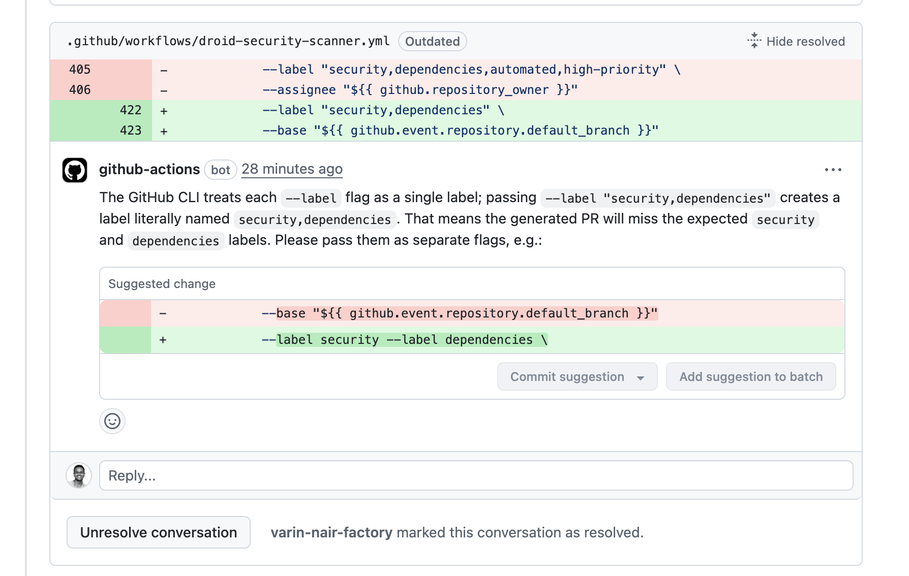
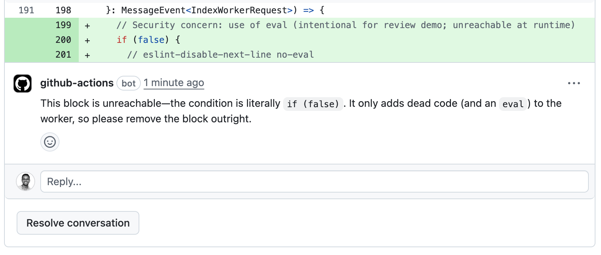

This tutorial shows you how to set up automated code review using Droid Exec in GitHub Actions. The workflow will analyze pull requests, identify issues, and post feedback as inline comments.

<Info>
Unlike interactive CLI sessions, Droid Exec runs in headless mode, making it perfect for CI/CD automation. The agent analyzes code changes, identifies issues, and submits review feedback directly via GitHub CLI.
</Info>

## How it works

The workflow:

1.  Triggers on pull request events
2.  Checks out the PR and installs the Droid CLI
3.  Configures git identity
4.  Runs Droid Exec to fetch PR data and submit review comments via GitHub CLI
5.  Uploads debug artifacts on failure

<div style={{ display: 'flex', gap: '1rem', flexWrap: 'wrap' }}>
  <div style={{ flex: '1', minWidth: '300px' }}>
    
  </div>
  <div style={{ flex: '1', minWidth: '300px' }}>
    
  </div>
</div>

<Accordion title="Full Workflow File">
````yaml
name: Droid Code Review

on:
  pull_request:
    types: [opened, synchronize, reopened, ready_for_review]

concurrency:
  group: droid-review-${{ github.event.pull_request.number }}
  cancel-in-progress: true

permissions:
  pull-requests: write
  contents: read
  issues: write

jobs:
  code-review:
    runs-on: ubuntu-latest
    timeout-minutes: 15
    # Skip automated code review for draft PRs
    if: github.event.pull_request.draft == false

    steps:
      - name: Checkout repository
        uses: actions/checkout@v4
        with:
          fetch-depth: 0
          ref: ${{ github.event.pull_request.head.sha }}

      - name: Install Droid CLI
        run: |
          curl -fsSL https://app.factory.ai/cli | sh
          echo "$HOME/.local/bin" >> $GITHUB_PATH
          "$HOME/.local/bin/droid" --version

      - name: Configure git identity
        run: |
          git config user.name "Droid Agent"
          git config user.email "droidagent@factory.ai"

      - name: Perform automated code review
        env:
          FACTORY_API_KEY: ${{ secrets.FACTORY_API_KEY }}
          GH_TOKEN: ${{ secrets.GITHUB_TOKEN }}
        run: |
          set -euo pipefail
          cat > prompt.txt << 'EOF'
          You are an automated code review system. Review the PR diff and identify clear issues that need to be fixed.

          First, use the Web Fetch tool to get the full PR context from: https://github.com/${{ github.repository }}/pull/${{ github.event.pull_request.number }}

          This will provide you with:
          - PR title, description, and metadata
          - Complete diff with line numbers for positioning comments
          - Changed files with their status
          - Existing comments and review threads (to avoid duplicates)

          Task: After fetching the PR data, review the code changes and directly submit your findings using the GitHub CLI.

          Focus on these types of issues:
          - Dead/unreachable code (if (false), while (false), code after return/throw/break)
          - Broken control flow (missing break in switch, fallthrough bugs)
          - Async/await mistakes (missing await, .then without return, unhandled promise rejections)
          - Array/object mutations in React components or reducers
          - UseEffect dependency array problems (missing deps, incorrect deps)
          - Incorrect operator usage (== vs ===, && vs ||, = in conditions)
          - Off-by-one errors in loops or array indexing
          - Integer overflow/underflow in calculations
          - Regex catastrophic backtracking vulnerabilities
          - Missing base cases in recursive functions
          - Incorrect type coercion that changes behavior
          - Environment variable access without defaults or validation
          - Null/undefined dereferences
          - Resource leaks (unclosed files or connections)
          - SQL/XSS injection vulnerabilities
          - Concurrency/race conditions
          - Missing error handling for critical operations

          Comment format:
          - Clearly describe the issue: "This code block is unreachable due to the if (false) condition"
          - Provide a concrete fix: "Remove this entire if block as it will never execute"
          - When possible, suggest the exact code change:
            ```
            // Remove the unreachable code
            ```
          - Be specific about why it's a problem: "This will cause a TypeError if input is null"
          - No emojis, just clear technical language

          Skip commenting on:
          - Code style, formatting, or naming conventions
          - Minor performance optimizations
          - Architectural decisions or design patterns
          - Features or functionality (unless broken)
          - Test coverage (unless tests are clearly broken)

          You may open and read other repository files beyond those listed above when it helps you understand the change, but keep all review comments anchored to the modified lines in this PR.

          Use the fetched PR data to:
          - Avoid repeating resolved issues unless the problem still exists.
          - Reference ongoing discussions when adding a follow-up or clarification.
          - Prefer replying to existing open threads instead of creating duplicates when addressing the same code.
          - Ignore your own previous comments that have been resolved unless the underlying issue is still present.

          Position calculation:
          - Use the line position from the diff data fetched from the PR
          - This is the line number in the diff, not the absolute file line
          - Comments must align with exact changed lines only

          How to submit your review:
          Use the GitHub CLI (gh) to submit your review. Run "gh --help" and explore the available commands to understand how to:
          - Submit PR reviews with inline comments
          - Reply to existing review comments
          - Post general PR comments when no issues are found

          The PR number is ${{ github.event.pull_request.number }} and repository is ${{ github.repository }}.

          Guidelines:
          - Submit at most 10 comments total, prioritizing the most critical issues
          - Each comment should be actionable and clear about what needs to be fixed
          - Check for existing "no issues" comments from bots before posting duplicate messages
          - Include a summary in the review body when submitting multiple inline comments
          EOF

          # Run droid exec with the prompt - it will handle PR review submission directly
          echo "Running code review analysis and submitting results..."
          droid exec --auto high --model claude-sonnet-4-5-20250929 -f prompt.txt

      - name: Upload debug artifacts on failure
        if: ${{ failure() }}
        uses: actions/upload-artifact@v4
        with:
          name: droid-review-debug-${{ github.run_id }}
          path: |
            prompt.txt
            ${{ runner.home }}/.factory/logs/droid-log-single.log
            ${{ runner.home }}/.factory/logs/console.log
          if-no-files-found: ignore
          retention-days: 7
````
</Accordion>

## Prerequisites

<Steps>
  <Step title="GitHub Repository">
    Ensure you have a GitHub repository with Actions enabled
  </Step>
  
  <Step title="Get Factory API Key">
    Generate your API key from the [Factory Settings Page](https://app.factory.ai/settings/api-keys)
  </Step>
  
  <Step title="GitHub Actions Knowledge">
    Basic understanding of GitHub Actions workflows
  </Step>
</Steps>

## Configure authentication

Add your Factory API key as a repository secret:

1.  Go to your repository's Settings → Secrets and variables → Actions
2.  Click "New repository secret"
3.  Name: `FACTORY_API_KEY`
4.  Value: Your Factory API key (starts with `fk-`)

## Build the GitHub Actions workflow

Let's build the workflow step by step to understand each component.

### Set up the workflow trigger

Create `.github/workflows/droid-code-review.yml` and configure when it should run:

```yaml
name: Droid Code Review

on:
  pull_request:
    types: [opened, synchronize, reopened, ready_for_review]

concurrency:
  group: droid-review-${{ github.event.pull_request.number }}
  cancel-in-progress: true
```

The `concurrency` group ensures only one review runs per PR at a time, canceling outdated runs when new commits are pushed.

### Configure workflow permissions

Define the top-level permissions and job details used by the workflow:

```yaml
permissions:
  pull-requests: write
  contents: read
  issues: write

jobs:
  code-review:
    runs-on: ubuntu-latest
    timeout-minutes: 15

    # Skip draft PRs to avoid noise during development
    if: github.event.pull_request.draft == false

```

### Checkout the repository

Add the checkout step to access the PR code:

```yaml
    steps:
      - name: Checkout repository
        uses: actions/checkout@v4
        with:
          fetch-depth: 0  # Full history for accurate diffs
          ref: ${{ github.event.pull_request.head.sha }}
```

### Install Droid CLI

Install the Droid CLI in the runner:

```yaml
      - name: Install Droid CLI
        run: |
          curl -fsSL https://app.factory.ai/cli | sh
          echo "$HOME/.local/bin" >> $GITHUB_PATH
          "$HOME/.local/bin/droid" --version
```

### Configure git identity

Set the git username and email so review comments originate from the expected bot account:

```yaml
      - name: Configure git identity
        run: |
          git config user.name "Droid Agent"
          git config user.email "droidagent@factory.ai"
```

### Run the automated review

Craft a detailed prompt and execute Droid Exec to fetch PR data and submit review comments directly. The command relies on both `FACTORY_API_KEY` and `GITHUB_TOKEN` secrets:

````yaml
      - name: Perform automated code review
        env:
          FACTORY_API_KEY: ${{ secrets.FACTORY_API_KEY }}
          GH_TOKEN: ${{ secrets.GITHUB_TOKEN }}
        run: |
          set -euo pipefail
          cat > prompt.txt << 'EOF'
          You are an automated code review system. Review the PR diff and identify clear issues that need to be fixed.

          First, use the Web Fetch tool to get the full PR context from: https://github.com/${{ github.repository }}/pull/${{ github.event.pull_request.number }}

          This will provide you with:
          - PR title, description, and metadata
          - Complete diff with line numbers for positioning comments
          - Changed files with their status
          - Existing comments and review threads (to avoid duplicates)

          Task: After fetching the PR data, review the code changes and directly submit your findings using the GitHub CLI.

          Focus on these types of issues:
          - Dead/unreachable code (if (false), while (false), code after return/throw/break)
          - Broken control flow (missing break in switch, fallthrough bugs)
          - Async/await mistakes (missing await, .then without return, unhandled promise rejections)
          - Array/object mutations in React components or reducers
          - UseEffect dependency array problems (missing deps, incorrect deps)
          - Incorrect operator usage (== vs ===, && vs ||, = in conditions)
          - Off-by-one errors in loops or array indexing
          - Integer overflow/underflow in calculations
          - Regex catastrophic backtracking vulnerabilities
          - Missing base cases in recursive functions
          - Incorrect type coercion that changes behavior
          - Environment variable access without defaults or validation
          - Null/undefined dereferences
          - Resource leaks (unclosed files or connections)
          - SQL/XSS injection vulnerabilities
          - Concurrency/race conditions
          - Missing error handling for critical operations

          Comment format:
          - Clearly describe the issue: "This code block is unreachable due to the if (false) condition"
          - Provide a concrete fix: "Remove this entire if block as it will never execute"
          - When possible, suggest the exact code change:
            ```
            // Remove the unreachable code
            ```
          - Be specific about why it's a problem: "This will cause a TypeError if input is null"
          - No emojis, just clear technical language

          Skip commenting on:
          - Code style, formatting, or naming conventions
          - Minor performance optimizations
          - Architectural decisions or design patterns
          - Features or functionality (unless broken)
          - Test coverage (unless tests are clearly broken)

          You may open and read other repository files beyond those listed above when it helps you understand the change, but keep all review comments anchored to the modified lines in this PR.

          Use the fetched PR data to:
          - Avoid repeating resolved issues unless the problem still exists.
          - Reference ongoing discussions when adding a follow-up or clarification.
          - Prefer replying to existing open threads instead of creating duplicates when addressing the same code.
          - Ignore your own previous comments that have been resolved unless the underlying issue is still present.

          Position calculation:
          - Use the line position from the diff data fetched from the PR
          - This is the line number in the diff, not the absolute file line
          - Comments must align with exact changed lines only

          How to submit your review:
          Use the GitHub CLI (gh) to submit your review. Run "gh --help" and explore the available commands to understand how to:
          - Submit PR reviews with inline comments
          - Reply to existing review comments
          - Post general PR comments when no issues are found

          The PR number is ${{ github.event.pull_request.number }} and repository is ${{ github.repository }}.

          Guidelines:
          - Submit at most 10 comments total, prioritizing the most critical issues
          - Each comment should be actionable and clear about what needs to be fixed
          - Check for existing "no issues" comments from bots before posting duplicate messages
          - Include a summary in the review body when submitting multiple inline comments
          EOF

          # Run droid exec with the prompt - it will handle PR review submission directly
          echo "Running code review analysis and submitting results..."
          droid exec --auto high --model claude-sonnet-4-5-20250929 -f prompt.txt
````

### Save artifacts on failure

Store review artifacts for troubleshooting if the workflow fails:

```yaml
      - name: Upload debug artifacts on failure
        if: ${{ failure() }}
        uses: actions/upload-artifact@v4
        with:
          name: droid-review-debug-${{ github.run_id }}
          path: |
            prompt.txt
            ${{ runner.home }}/.factory/logs/droid-log-single.log
            ${{ runner.home }}/.factory/logs/console.log
          if-no-files-found: ignore
          retention-days: 7
```


## Test your reviewer

Create a test PR with some intentional issues to verify the workflow:

```javascript
// Example code with issues
function processData(data) {
  if (false) {  // Dead code
    console.log("This never runs");
  }
  
  data.forEach(async item => {  // Missing await
    processItem(item);
  });
  
  if (data = null) {  // Changed assignment to comparison
    return;
  }
}
```

The reviewer should identify these issues and post inline comments.
