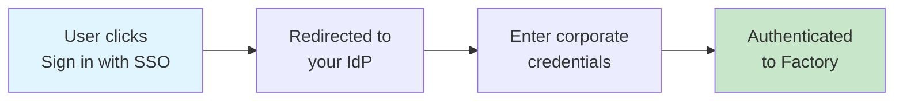
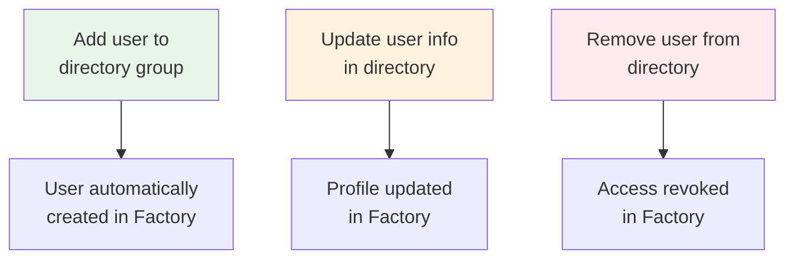

Factory provides comprehensive enterprise identity management through Single Sign-On (SSO) using SAML/OIDC protocols and automated user provisioning via Directory Sync (SCIM). This guide covers how these systems work together to manage user identities, authentication, and access control.

## Overview

Factory uses **WorkOS** to handle enterprise identity management, supporting:

- **Domain Verification**: Establish ownership of your email domains for identity governance
- **SSO/SAML**: Authenticate users through your Identity Provider (IdP)
- **Directory Sync/SCIM**: Automatically provision and manage users from your directory
- **Just-In-Time (JIT) Provisioning**: Create users on first login via SSO
- **Group-based Access Control**: Manage permissions through directory groups

## How It Works

### Domain Verification (Required First)

Before enabling SSO or Directory Sync:

1. **Verify ownership** of your email domains through DNS validation
2. **Claim existing users** - All users with your domain automatically join your organization
3. **Set policies** - Configure MFA, session management, and access controls
4. **Enable SSO/SCIM** - Now ready for enterprise identity management

### Authentication with SSO

When SSO is enabled:

1. Users click "Sign in with SSO" instead of entering a password
2. They're redirected to your corporate identity provider (Okta, Azure AD, etc.)
3. After authenticating with their corporate credentials, they're logged into Factory
4. First-time users are automatically created if JIT provisioning is enabled

### User Provisioning with Directory Sync

When Directory Sync (SCIM) is enabled:

- **Adding users** to your directory automatically creates them in Factory
- **Updating** user information syncs to Factory in real-time
- **Removing users** from your directory revokes their Factory access
- **Group changes** automatically update user permissions

### Data Priority

When users exist from multiple sources (SSO, Directory Sync, manual invite), Factory follows this priority:

1. **Directory Sync data always wins** - Information from your directory overwrites other sources
2. **Users are matched by email** - We find existing users by email address (case-insensitive)
3. **Custom data is preserved** - Factory-specific settings that don't exist in your directory are kept
4. **Soft deletes** - Removed users are deactivated, not deleted, preserving their work history

## Prerequisites

Before setting up Domains, SSO, and SCIM:

- You are on a plan that includes **enterprise SSO support**
- Your organization's **email domains must be verified** (see Domain Verification below)
- You have **admin access** to your IdP (or a partner in IT who does)
- You have a **Factory admin** who can coordinate configuration on the Factory side
- Contact your Factory representative to initiate the setup process

## Setup Process Overview

### Initial Setup Flow

<Steps>
  <Step title="Contact Factory">
    Request SSO/SCIM setup from your Factory account representative or via
    support@factory.ai
  </Step>

<Step title="Receive Setup Link">
  You'll receive a secure setup link (valid for 7 days) to configure your
  identity provider
</Step>

<Step title="Select Provider">
  Choose your identity provider from the supported list or select "Generic
  SAML/OIDC"
</Step>

<Step title="Verify Your Domains (Required)">
  Complete domain verification via DNS to establish ownership - SSO cannot be enabled without this step
</Step>

<Step title="Configure SSO">
  Follow provider-specific instructions to set up SAML or OIDC authentication
</Step>

<Step title="Enable Directory Sync (Optional)">
  Configure SCIM provisioning for automated user management
</Step>

  <Step title="Test & Verify">
    Test with pilot users before rolling out to entire organization
  </Step>
</Steps>

### Setup Options

During setup, you'll configure:

<AccordionGroup>
  <Accordion title="Connection Type">
    - **SAML 2.0** - Recommended for enterprise IdPs - **OIDC** - Modern
    protocol with better mobile support - **Both** - Some providers support dual
    protocols
  </Accordion>

<Accordion title="User Provisioning">
  - **Just-In-Time (JIT)** - Users created on first login - **Directory Sync
  (SCIM)** - Automated provisioning from directory - **Manual** - Admin invites
  users individually - **Hybrid** - Combination of methods
</Accordion>

<Accordion title="Role Mapping">
  - **Attribute-based** - Roles from SAML/OIDC claims - **Group-based** - Roles
  from directory groups - **Default role** - All users get same initial role -
  **Custom mapping** - Advanced rules engine
</Accordion>

  <Accordion title="MFA Requirements">
    - **IdP-enforced** - MFA handled by your IdP - **Factory-enforced** -
    Additional MFA layer - **Conditional** - Based on user role or location -
    **Optional** - User choice
  </Accordion>
</AccordionGroup>

## Domain Verification

### Why Domain Verification Matters

Domain verification is a **mandatory prerequisite** for enabling SSO and establishing your organization's identity governance in Factory. It proves your organization owns and controls specific email domains, creating a secure foundation for enterprise identity management.

<Warning>
  SSO cannot be enabled without verified domains. All users authenticating via
  SSO must have email addresses from verified domains.
</Warning>

### What Domain Verification Enables

Once your domain is verified, your organization gains powerful administrative controls:

#### Identity Governance

- **Mandatory SSO enforcement** - Require all users with your domain to authenticate via SSO
- **Automatic user claiming** - Existing Factory users with your domain automatically join your organization
- **Email domain restrictions** - Prevent unauthorized accounts from using your domain
- **Guest user policies** - Define how external collaborators can access your organization

#### Security Policies

- **MFA requirements** - Enforce multi-factor authentication for all domain users
- **Password policies** - Set complexity requirements for non-SSO authentication methods
- **Session management** - Control session duration and idle timeout settings
- **IP restrictions** - Limit access to specific IP ranges or VPN endpoints

#### Compliance Controls

- **Audit logging** - Track all authentication events for domain users
- **Data residency** - Ensure user data stays within specified geographic regions
- **Access reviews** - Periodic certification of user access rights
- **Deprovisioning workflows** - Automated removal of access when users leave

### Configuring Domain Verification

<Info>
**Domain verification is handled automatically through WorkOS.** You have two options:

1. **Automatic Setup** - Your Factory admin handles the entire process for you
2. **Self-Service Setup** - Use the WorkOS dashboard to verify domains yourself

Both options follow the same verification flow:

- Add domains to verify (e.g., `yourcompany.com`)
- Receive a unique TXT record for DNS validation
- Add the record to your domain's DNS settings
- WorkOS automatically detects and validates the record
- Configure domain policies once verified

The process typically completes within 1-24 hours depending on DNS propagation. WorkOS provides real-time status updates and handles all the technical complexity.

</Info>

#### What Happens After Verification

Once your domain is verified:

- **Immediate effect** - All existing users with your domain email are associated with your organization
- **Automatic claiming** - New users with your domain join your organization by default
- **Policy enforcement** - Your configured security policies apply instantly
- **SSO readiness** - You can proceed with SSO configuration for verified domains

### Multiple Domain Support

Organizations often need to verify multiple domains:

- **Primary domain** - Your main corporate email domain
- **Subsidiary domains** - Acquired companies or regional offices
- **Legacy domains** - Historical domains still in use
- **Alias domains** - Alternative spellings or shortened versions

Each domain requires separate verification but shares the same organizational policies once verified.

### Domain Verification Best Practices

<AccordionGroup>
  <Accordion title="Planning">
    - Inventory all email domains used by employees - Identify domains that
    should NOT be claimed (e.g., personal email domains) - Coordinate with DNS
    administrators before starting - Plan for subsidiary and acquisition
    scenarios
  </Accordion>

<Accordion title="Implementation">
  - Verify your primary domain first - Test with a small pilot group before
  organization-wide rollout - Document which team manages each domain's DNS -
  Keep verification records even after validation completes
</Accordion>

  <Accordion title="Maintenance">
    - Review verified domains quarterly - Remove domains no longer in use -
    Update verification during domain migrations - Monitor for unauthorized
    domain usage attempts
  </Accordion>
</AccordionGroup>

### Common Issues and Solutions

| Issue                                 | Cause                           | Solution                                           |
| ------------------------------------- | ------------------------------- | -------------------------------------------------- |
| Verification fails after 24 hours     | DNS record not properly added   | Check exact formatting and placement of TXT record |
| Users can't access after verification | Domain policies too restrictive | Review and adjust enforcement settings             |
| Subsidiary users not included         | Domain not verified             | Add and verify all subsidiary domains              |
| External collaborators blocked        | Strict domain enforcement       | Configure guest user exceptions                    |

<Info>
  Domain verification is a one-time setup per domain, but the benefits apply to
  all current and future users with email addresses from those domains.
</Info>

## Single Sign-On (SSO)

### How SSO Works

1. User attempts to log in to Factory
2. Redirected to your Identity Provider (IdP)
3. User authenticates with corporate credentials
4. IdP sends SAML assertion back to Factory
5. User is authenticated and provisioned if needed (see JIT below)

### Supported SSO Providers

Factory supports integration with all major identity providers through WorkOS. Select your provider during setup:

#### Popular SSO Providers

<Tabs>
  <Tab title="SAML Providers">
    - **Okta** - Full SAML 2.0 and SCIM support - **Microsoft Azure AD / Entra
    ID** - SAML and OIDC with SCIM - **Google Workspace** - SAML 2.0 with Google
    Groups mapping - **OneLogin** - SAML 2.0 and SCIM provisioning - **Ping
    Identity / PingOne** - Enterprise SAML federation - **JumpCloud** - SAML
    with cross-directory support - **CyberArk** - SAML with privileged access
    management - **Duo (Cisco)** - SAML with MFA integration
  </Tab>

<Tab title="OIDC Providers">
  - **Auth0** - Universal OIDC with custom rules - **Keycloak** - Open-source
  OIDC provider - **AWS Cognito** - OIDC with AWS integration - **Firebase
  Auth** - Google's OIDC implementation - **FusionAuth** - Developer-focused
  OIDC
</Tab>

<Tab title="Enterprise Platforms">
  - **Salesforce Identity** - SAML for Salesforce orgs - **VMware Workspace
  ONE** - Enterprise mobility + SAML - **IBM Security Verify** - Enterprise
  SAML/OIDC - **Oracle Identity Cloud** - Oracle ecosystem integration - **RSA
  SecurID** - SAML with token-based MFA
</Tab>

  <Tab title="Generic Options">
    - **Generic SAML 2.0** - Any SAML-compliant IdP
    - **Generic OIDC** - Any OpenID Connect provider
    - **ADFS** - Microsoft Active Directory Federation Services
    - **Shibboleth** - Academic/research institution SSO
    - **SimpleSAMLphp** - Open-source SAML implementation
  </Tab>
</Tabs>

#### Magic Link Alternative

If your organization doesn't use SSO, Factory also supports:

- **Magic Link Authentication** - Passwordless email-based login
- Can be used alongside SSO for external collaborators

### Just-In-Time (JIT) Provisioning

When SSO is enabled with JIT provisioning:

- Users are automatically created on first successful login
- User profile is populated from SAML attributes
- Organization membership is created automatically
- No manual user invitation required

<Warning>
  JIT provisioning can conflict with Directory Sync. See [Conflict
  Resolution](#conflict-resolution) for best practices.
</Warning>

### Configuring SSO

#### What You Need to Prepare

Before starting SSO setup:

1. **Admin access** to your identity provider
2. **Test users** - Create a pilot group (e.g., `factory-pilot-users`) to test before organization-wide rollout
3. **Group strategy** - Decide which IdP groups map to Factory roles:
   - Admin groups (e.g., `factory-admins`)
   - Member groups (e.g., `factory-developers`)
   - Read-only groups (e.g., `factory-viewers`)

#### How Setup Works

<Info>
**WorkOS handles the technical configuration automatically.** When you receive your setup link from Factory:

1. Click the link and select your identity provider
2. Follow the guided setup wizard specific to your IdP
3. WorkOS automatically configures all SAML/OIDC settings
4. Test the connection with your pilot group
5. Roll out to your organization

You don't need to manually configure URLs, certificates, or technical parameters - WorkOS handles this based on your provider.

</Info>

#### Group-to-Role Mapping

During setup, you'll configure how your IdP groups map to Factory roles:

| Your IdP Group        | Maps to Factory Role | Permissions                               |
| --------------------- | -------------------- | ----------------------------------------- |
| `factory-admins`      | Admin                | Full access, manage users and settings    |
| `factory-developers`  | Member               | Create and edit content, use all features |
| `factory-viewers`     | Viewer               | Read-only access                          |
| `factory-contractors` | Member               | Same as developers, but easier to track   |

<Tip>
  Use descriptive group names in your IdP to make management easier. Groups like
  `factory-frontend-team` or `factory-qa-engineers` help you organize
  permissions by team.
</Tip>

#### Testing Your Integration

After configuration, test with your pilot group:

1. Have a test user sign in via SSO from the Factory login page
2. Initiate login from the Factory sign‑in page using “Sign in with SSO” / your IdP button.
3. Verify that:
   - The user is redirected to the IdP, authenticates, and returns to Factory.
   - The user lands in the correct org/team with the expected role.

If anything fails, check the IdP’s logs and Factory’s error message; most issues are due to mismatched URLs, certificates, or attribute mappings.

---

## Directory Sync (SCIM) Provisioning

SSO controls **how users authenticate**; SCIM controls **which users and groups exist** in Factory.

With SCIM enabled:

- New employees in relevant IdP groups get access to Factory automatically.
- Users removed from those groups lose access automatically.
- Group membership changes propagate into Factory without manual updates.

### Supported Directory Sync Providers

Factory supports SCIM 2.0 provisioning from these directory providers:

<Tabs>
  <Tab title="Full SCIM Support">
    **Providers with complete SCIM 2.0 implementation:**
    
    - **Okta** - Real-time provisioning with Okta Universal Directory
    - **Microsoft Azure AD / Entra ID** - Enterprise directory sync
    - **OneLogin** - User and group provisioning
    - **JumpCloud** - Cross-platform directory services
    - **Google Workspace** - Google Groups and organizational units
    - **PingOne** - PingDirectory integration
    - **CyberArk** - Privileged access provisioning
  </Tab>

<Tab title="Partial Support">
    **Providers with limited SCIM features:**
    
    - **Rippling** - HR-driven provisioning
    - **BambooHR** - Employee lifecycle management
    - **Workday** - HCM-based provisioning
    - **AWS SSO** - AWS Identity Center provisioning
    
    Note: These providers may require additional configuration or have limitations on group management.
  </Tab>
  
  <Tab title="Custom Integration">
    **Build your own SCIM integration:**
    
    - **Generic SCIM 2.0** - Any SCIM-compliant directory
    - **Custom SCIM Endpoint** - Your internal user directory
    - **LDAP Bridge** - Connect legacy LDAP/AD via SCIM gateway
    - **CSV Upload** - Manual bulk provisioning (not real-time)
  </Tab>
</Tabs>

### SCIM Features by Provider

| Provider            | Users | Groups  | Real-time | Nested Groups | Custom Attributes |
| ------------------- | ----- | ------- | --------- | ------------- | ----------------- |
| Okta                | ✅    | ✅      | ✅        | ✅            | ✅                |
| Azure AD / Entra ID | ✅    | ✅      | ✅        | ✅            | ✅                |
| Google Workspace    | ✅    | ✅      | ✅        | ❌            | Partial           |
| OneLogin            | ✅    | ✅      | ✅        | ❌            | ✅                |
| JumpCloud           | ✅    | ✅      | ✅        | ✅            | ✅                |
| Rippling            | ✅    | Partial | ✅        | ❌            | Partial           |
| Generic SCIM        | ✅    | ✅      | Varies    | Varies        | Varies            |

### Configuring Directory Sync

#### What You Need to Prepare

Before enabling SCIM:

1. **Decide which groups to sync** - Not all IdP groups need Factory access
2. **Plan your group structure** - Consider teams, roles, and access levels
3. **Identify service accounts** - Separate human users from CI/CD accounts
4. **Review existing users** - Understand how they'll be affected when SCIM takes over

Treat the SCIM token as a secret; store it only in your IdP’s application configuration.

#### How SCIM Setup Works

<Info>
**WorkOS handles the SCIM configuration automatically.** When you receive your setup link from Factory:

1. WorkOS provides a SCIM endpoint URL and bearer token
2. You enter these in your IdP's SCIM configuration
3. Select which groups to sync (e.g., only `factory-*` groups)
4. WorkOS automatically handles:
   - User attribute mapping (email, name, etc.)
   - Group synchronization
   - Real-time updates via webhooks
   - Conflict resolution with existing users

You don't need to configure attribute mappings or technical settings - WorkOS manages this based on SCIM 2.0 standards.

</Info>

#### Configuring SCIM in Your IdP

In your IdP’s SCIM settings for the Factory application:

1. Enable **automatic provisioning**.
2. Paste the **SCIM base URL** and **SCIM token** from Factory.
3. Choose which users and groups to sync (for example, only `factory-*` groups).
4. Configure attribute mappings if required (for example, `userName` → email, `displayName` → name).

Once enabled, your IdP will start pushing users and groups to Factory and keep them synchronized.

#### What Happens When SCIM is Enabled

With SCIM in place, group management should happen **only in your IdP**.

Use group naming and mapping rules such as:

- `factory-org-owners` → Factory org Owners.
- `factory-org-admins` → Factory org Admins.
- `factory-users` → Factory Members.
- `factory-ci-bots` → machine/service accounts with restricted permissions.

This keeps RBAC definitions in one place (your IdP) and lets you audit them alongside other enterprise apps.

## Data Management and Merging

### User Identity Sources

Factory users can originate from multiple sources:

- **Directory Sync**: Automatically provisioned via SCIM
- **SSO JIT**: Created on first SSO login
- **Manual Invitation**: Added by administrators
- **API**: Created programmatically

### Merging Strategy

When users exist from multiple sources, Factory follows these rules:

1. **Directory data takes precedence** - SCIM attributes override all other sources
2. **Email-based matching** - Users matched by email (case-insensitive)
3. **Soft deletes only** - Users deactivated, not deleted, preserving audit trails
4. **Profile preservation** - Non-directory fields retained during updates

## Conflict Resolution

### SSO vs Directory Sync

When both are enabled, potential conflicts include:

**Scenario**: User logs in via SSO before directory provisions them  
**Resolution**: Directory sync merges with SSO user on next sync

**Best Practice**: Choose one primary method:

- **Directory-first**: Disable JIT, require directory provisioning
- **SSO-first**: Use JIT for creation, directory for updates

### Email Case Sensitivity

All email matching is case-insensitive:

- `John.Doe@company.com` = `john.doe@company.com`
- Prevents duplicate users from case variations
- Emails normalized to lowercase for comparison

---

## Troubleshooting & best practices

Common issues and recommendations:

- **Login loops or failures**

  - Verify ACS / redirect URLs exactly match what Factory provided.
  - Confirm certificates or signing keys have not expired or been rotated without updating Factory.

- **User lands in wrong org or role**

  - Check group memberships and mapping rules.
  - Ensure the intended groups are included in SAML assertions or ID tokens.

- **Provisioning not working**
  - Confirm SCIM is enabled in both Factory and your IdP.
  - Check SCIM logs in your IdP for errors (invalid token, URL, or schema).

Best practices:

- Keep a **small pilot group** for initial rollout and future changes.
- Use **clear, prefix‑based group names** (for example, `factory-*`) to keep IdP configuration maintainable.
- Manage all role changes and access reviews in your IdP to leverage existing governance processes.

Once SSO and SCIM are in place, the **Identity & Access Management** overview explains how these identities are enforced at runtime for Droids.
