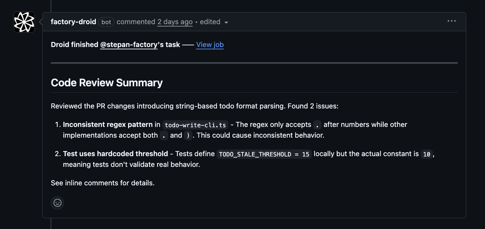
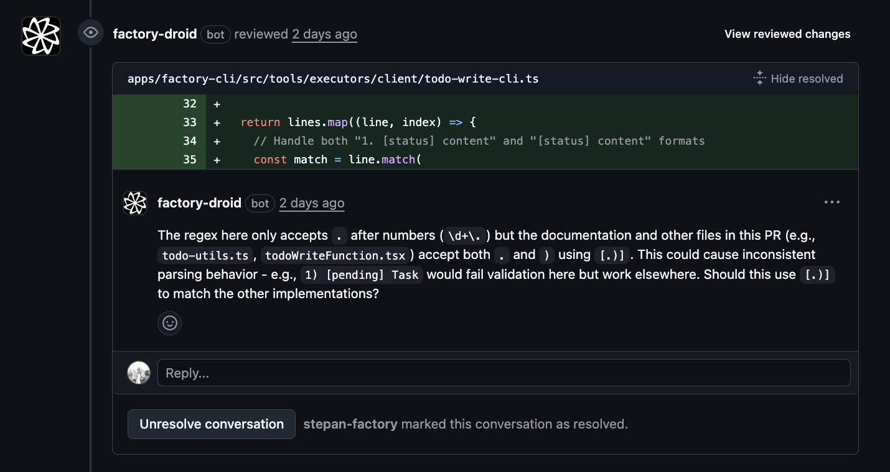

Set up automated code review for your repository using the Factory GitHub App. Droid will analyze pull requests, identify issues, and post feedback as inline comments.

<div style={{ display: 'flex', gap: '1rem', flexWrap: 'wrap' }}>
  <div style={{ flex: '1', minWidth: '300px' }}>
    
  </div>
  <div style={{ flex: '1', minWidth: '300px' }}>
    
  </div>
</div>

## Setup

Use the `/install-gh-app` command to install the Factory GitHub App and configure the code review workflow:

```bash
droid
> /install-gh-app
```

The guided flow will:
1. Verify GitHub CLI prerequisites
2. Install the Factory GitHub App on your repository
3. Let you select the **Droid Review** workflow
4. Create a PR with the workflow files

For detailed setup instructions, see the [GitHub App installation guide](/cli/features/install-github-app).

## How it works

Once enabled, the Droid Review workflow:

1. Triggers on pull request events (opened, synchronized, reopened, ready for review)
2. Skips draft PRs to avoid noise during development
3. Fetches the PR diff and existing comments
4. Analyzes code changes for issues
5. Posts inline comments on problematic lines
6. Submits an approval when no issues are found

## What Droid reviews

The automated reviewer focuses on clear bugs and issues:

- Dead/unreachable code
- Broken control flow (missing break, fallthrough bugs)
- Async/await mistakes
- Null/undefined dereferences
- Resource leaks
- SQL/XSS injection vulnerabilities
- Missing error handling
- Off-by-one errors
- Race conditions

It skips stylistic concerns, minor optimizations, and architectural opinions.

## Customizing the workflow

After the workflow is created, you can customize it by editing `.github/workflows/droid-review.yml` in your repository.

### Change the trigger conditions

Modify when reviews run:

```yaml
on:
  pull_request:
    types: [opened, synchronize, reopened, ready_for_review]
    paths:
      - 'src/**'  # Only review changes in src/
      - '!**/*.test.ts'  # Skip test files
```

### Adjust the review focus

Edit the prompt in the workflow to change what Droid looks for. For example, to add framework-specific checks:

```yaml
run: |
  cat > prompt.txt << 'EOF'
  You are an automated code review system...
  
  Additional checks for this codebase:
  - React hooks rules violations
  - Missing TypeScript types on public APIs
  - Prisma query performance issues
  EOF
```

### Change the model

Use a different model for reviews:

```yaml
droid exec --auto high --model claude-sonnet-4-5-20250929 -f prompt.txt
# Or use a faster model for quicker feedback:
droid exec --auto high --model claude-haiku-4-5-20251001 -f prompt.txt
```

### Skip certain PRs

Add conditions to skip reviews for specific cases:

```yaml
jobs:
  code-review:
    # Skip bot PRs and PRs with [skip-review] in title
    if: |
      github.event.pull_request.draft == false &&
      !contains(github.event.pull_request.user.login, '[bot]') &&
      !contains(github.event.pull_request.title, '[skip-review]')
```

### Limit comment count

Adjust the maximum number of comments in the prompt:

```
Guidelines:
- Submit at most 5 comments total, prioritizing the most critical issues
```

## See also

- [GitHub App installation](/cli/features/install-github-app) - Full setup guide for `/install-gh-app`
- [GitHub Actions examples](/guides/droid-exec/github-actions) - More automation workflows
- [Droid Exec](/cli/commands/exec) - Running Droid in CI/CD environments
