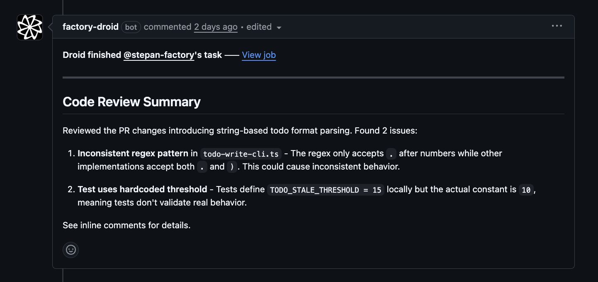
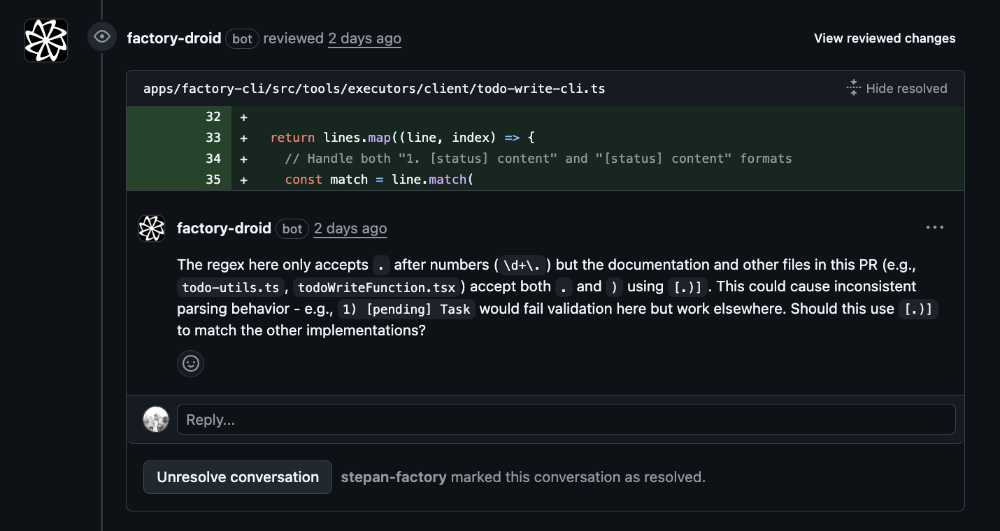

Set up automated code review for GitHub or GitLab repositories. Droid analyzes pull requests and merge requests, identifies issues, and posts feedback as inline comments. For GitHub repositories, the setup flow checks the Factory Droid GitHub App installation as part of configuring review automation.

<div style={{ display: 'flex', gap: '1rem', flexWrap: 'wrap' }}>
  <div style={{ flex: '1', minWidth: '300px' }}>
    
  </div>
  <div style={{ flex: '1', minWidth: '300px' }}>
    
  </div>
</div>

## Setup

Use the `/install-code-review` command to set up automated code review for GitHub or GitLab:

```bash
droid
> /install-code-review
```

The guided flow will:
1. Detect your SCM platform (GitHub or GitLab)
2. Verify prerequisites (CLI tools, permissions)
3. Walk you through review configuration (depth, security, triggers)
4. Create a PR/MR with the workflow files

## How it works

Once enabled, the Droid Review workflow:

1. Triggers on pull request events (opened, synchronize, reopened, ready for review)
2. Skips draft PRs to avoid noise during development
3. Fetches the PR diff and existing comments
4. Analyzes code changes for bugs, security issues, and correctness problems
5. Posts inline comments on problematic lines
6. Submits an approval when no issues are found

## Review depth

The `review_depth` input controls the thoroughness and cost of each review. You choose the depth during `/install-code-review` setup, or set it directly in your workflow.

- **`deep`** (default) — Thorough analysis with higher reasoning effort. Catches more subtle bugs but costs more per review. Best for production code and security-sensitive repos.
- **`shallow`** — Faster, more cost-effective reviews that cover surface-level issues. Good for high-volume repos, draft PRs, or teams watching spend.

```yaml
with:
  automatic_review: true
  review_depth: deep  # or shallow
```

You can also override the model or reasoning effort directly with `review_model` and `reasoning_effort`, which take precedence over the depth preset.

## Security review

Security review is a dedicated workflow for STRIDE, OWASP, OWASP LLM Top 10, and supply-chain analysis. See [Security Review](/enterprise/security-review) for automatic PR security reviews, scheduled scans, and local full-codebase audits with the built-in `security-review` skill.

## What Droid reviews

The automated reviewer focuses on clear bugs and issues:

- Dead/unreachable code
- Broken control flow (missing break, fallthrough bugs)
- Async/await mistakes
- Null/undefined dereferences
- Resource leaks
- SQL/XSS injection vulnerabilities
- Missing error handling
- Off-by-one errors
- Race conditions

It skips stylistic concerns, minor optimizations, and architectural opinions.

## Customizing the workflow

After the workflow is created, you can customize it by editing `.github/workflows/droid-review.yml` in your repository.

### Change the trigger conditions

Modify when reviews run:

```yaml
on:
  pull_request:
    types: [opened, synchronize, reopened, ready_for_review]
    paths:
      - 'src/**'  # Only review changes in src/
      - '!**/*.test.ts'  # Skip test files
```

### Custom review guidelines

Add repository-specific review guidelines by creating a `.factory/skills/review-guidelines/SKILL.md` file in your repo:

```markdown
<!-- .factory/skills/review-guidelines/SKILL.md -->

Additional checks for this codebase:
- React hooks rules violations
- Missing TypeScript types on public APIs
- Prisma query performance issues
```

These guidelines are automatically picked up and injected into every review run. No workflow changes needed.

### Change the model

Use a different model for reviews:

```yaml
droid exec --auto high --model claude-sonnet-4-5-20250929 -f prompt.txt
# Or use a faster model for quicker feedback:
droid exec --auto high --model claude-haiku-4-5-20251001 -f prompt.txt
```

### Skip certain PRs

Add conditions to skip reviews for specific cases:

```yaml
jobs:
  code-review:
    # Skip bot PRs and PRs with [skip-review] in title
    if: |
      github.event.pull_request.draft == false &&
      !contains(github.event.pull_request.user.login, '[bot]') &&
      !contains(github.event.pull_request.title, '[skip-review]')
```

### Limit comment count

Adjust the maximum number of comments in the prompt:

```
Guidelines:
- Submit at most 5 comments total, prioritizing the most critical issues
```

## All workflow inputs

| Input | Default | Description |
|-------|---------|-------------|
| `automatic_review` | `false` | Automatically review PRs without `@droid review` |
| `review_depth` | `deep` | Review preset: `deep` (thorough) or `shallow` (fast) |
| `review_model` | (from depth) | Override model for code review |
| `reasoning_effort` | (from depth) | Override reasoning effort |
| `include_suggestions` | `true` | Include code suggestion blocks in comments |

Security review inputs are documented in [Security Review](/enterprise/security-review#configuration).

## See also

- [Security Review](/enterprise/security-review) - Security-focused PR reviews and full-codebase audits
- [GitHub Integration Security](/enterprise/github-integration-security) - Security architecture for the GitHub App integration
- [GitHub Actions examples](/guides/droid-exec/github-actions) - More automation workflows
- [Droid Exec](/cli/droid-exec/overview) - Running Droid in CI/CD environments
