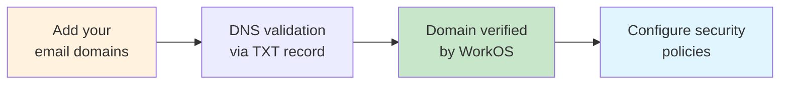
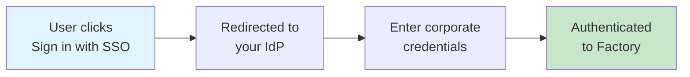
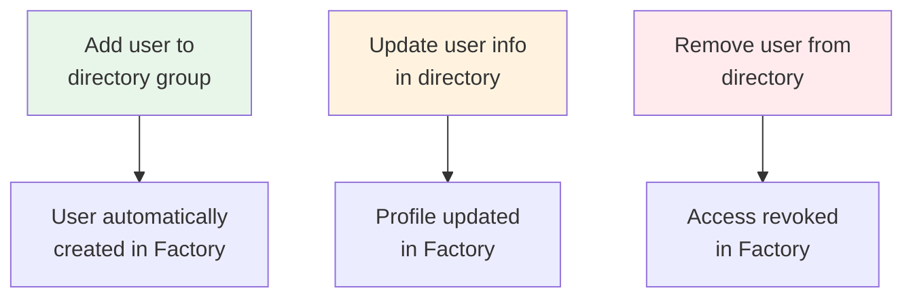

Factoryは、SAML/OIDCプロトコルを使用したSingle Sign-On（SSO）と、Directory Sync（SCIM）による自動ユーザープロビジョニングを通じて、包括的なエンタープライズアイデンティティ管理を提供します。このガイドでは、これらのシステムがどのように連携してユーザーアイデンティティ、認証、アクセス制御を管理するかについて説明します。

## 概要

Factoryは**WorkOS**を使用してエンタープライズアイデンティティ管理を処理し、以下をサポートします：

- **ドメイン検証**: アイデンティティガバナンスのためのメールドメインの所有権を確立
- **SSO/SAML**: Identity Provider（IdP）を通じたユーザー認証
- **Directory Sync/SCIM**: ディレクトリからのユーザーの自動プロビジョニングと管理
- **Just-In-Time（JIT）プロビジョニング**: SSO経由の初回ログイン時にユーザーを作成
- **グループベースアクセス制御**: ディレクトリグループを通じた権限管理

## 仕組み

### ドメイン検証（最初に必要）

SSOやDirectory Syncを有効にする前に：

1. **所有権を検証** - DNS検証を通じてメールドメインの所有権を確認
2. **既存ユーザーを取得** - あなたのドメインを持つすべてのユーザーが自動的に組織に参加
3. **ポリシーを設定** - MFA、セッション管理、アクセス制御を構成
4. **SSO/SCIMを有効化** - エンタープライズアイデンティティ管理の準備完了

### SSOを使った認証

SSOが有効な場合：

1. ユーザーはパスワードを入力する代わりに「SSOでサインイン」をクリック
2. 企業のIdentity Provider（Okta、Azure ADなど）にリダイレクト
3. 企業の認証情報で認証した後、Factoryにログイン
4. JITプロビジョニングが有効な場合、初回ユーザーは自動的に作成される

### Directory Syncを使ったユーザープロビジョニング

Directory Sync（SCIM）が有効な場合：

- ディレクトリへの**ユーザー追加**により、Factoryで自動的にユーザーが作成
- ユーザー情報の**更新**がFactoryにリアルタイムで同期
- ディレクトリからの**ユーザー削除**により、FactoryのアクセスがRevoke
- **グループの変更**により、ユーザー権限が自動的に更新

### データの優先度

ユーザーが複数のソース（SSO、Directory Sync、手動招待）から存在する場合、Factoryは以下の優先度に従います：

1. **Directory Syncデータが常に優先** - ディレクトリからの情報が他のソースを上書き
2. **ユーザーはメールでマッチング** - メールアドレス（大文字小文字を区別しない）で既存ユーザーを検索
3. **カスタムデータは保持** - ディレクトリに存在しないFactory固有の設定は維持
4. **論理削除** - 削除されたユーザーは無効化され、削除されず、作業履歴を保持

## 前提条件

Domains、SSO、SCIMを設定する前に：

- **エンタープライズSSO支援**を含むプランを利用している
- 組織の**メールドメインが検証済み**である（以下のドメイン検証を参照）
- IdPへの**管理者アクセス**がある（またはITの協力者がいる）
- Factory側の設定を調整できる**Factory管理者**がいる
- 設定プロセスを開始するためにFactoryの担当者に連絡

## 設定プロセスの概要

### 初期設定フロー

<Steps>
  <Step title="Contact Factory">
    Request SSO/SCIM setup from your Factory account representative or via
    support@factory.ai
  </Step>

<Step title="Receive Setup Link">
  You'll receive a secure setup link (valid for 7 days) to configure your
  identity provider
</Step>

<Step title="Select Provider">
  Choose your identity provider from the supported list or select "Generic
  SAML/OIDC"
</Step>

<Step title="Verify Your Domains (Required)">
  Complete domain verification via DNS to establish ownership - SSO cannot be enabled without this step
</Step>

<Step title="Configure SSO">
  Follow provider-specific instructions to set up SAML or OIDC authentication
</Step>

<Step title="Enable Directory Sync (Optional)">
  Configure SCIM provisioning for automated user management
</Step>

  <Step title="Test & Verify">
    Test with pilot users before rolling out to entire organization
  </Step>
</Steps>

### 設定オプション

設定中に以下を構成します：

<AccordionGroup>
  <Accordion title="Connection Type">
    - **SAML 2.0** - Recommended for enterprise IdPs - **OIDC** - Modern
    protocol with better mobile support - **Both** - Some providers support dual
    protocols
  </Accordion>

<Accordion title="User Provisioning">
  - **Just-In-Time (JIT)** - Users created on first login - **Directory Sync
  (SCIM)** - Automated provisioning from directory - **Manual** - Admin invites
  users individually - **Hybrid** - Combination of methods
</Accordion>

<Accordion title="Role Mapping">
  - **Attribute-based** - Roles from SAML/OIDC claims - **Group-based** - Roles
  from directory groups - **Default role** - All users get same initial role -
  **Custom mapping** - Advanced rules engine
</Accordion>

  <Accordion title="MFA Requirements">
    - **IdP-enforced** - MFA handled by your IdP - **Factory-enforced** -
    Additional MFA layer - **Conditional** - Based on user role or location -
    **Optional** - User choice
  </Accordion>
</AccordionGroup>

## ドメイン検証

### ドメイン検証が重要な理由

ドメイン検証は、SSOを有効にし、Factoryで組織のアイデンティティガバナンスを確立するための**必須の前提条件**です。これにより、組織が特定のメールドメインを所有・制御していることが証明され、エンタープライズアイデンティティ管理の安全な基盤が作成されます。

<Warning>
  SSO cannot be enabled without verified domains. All users authenticating via
  SSO must have email addresses from verified domains.
</Warning>

### ドメイン検証で可能になること

ドメインが検証されると、組織は強力な管理制御を獲得します：

#### アイデンティティガバナンス

- **必須SSO実行** - あなたのドメインを持つすべてのユーザーにSSO経由での認証を要求
- **自動ユーザー取得** - あなたのドメインを持つ既存のFactoryユーザーが自動的に組織に参加
- **メールドメイン制限** - 未承認のアカウントがあなたのドメインを使用することを防止
- **ゲストユーザーポリシー** - 外部協力者があなたの組織にアクセスする方法を定義

#### セキュリティポリシー

- **MFA要件** - すべてのドメインユーザーに多要素認証を強制
- **パスワードポリシー** - SSO以外の認証方法の複雑さ要件を設定
- **セッション管理** - セッション期間とアイドルタイムアウト設定を制御
- **IP制限** - 特定のIP範囲やVPNエンドポイントへのアクセス制限

#### コンプライアンス制御

- **監査ログ** - ドメインユーザーのすべての認証イベントを追跡
- **データ居住性** - ユーザーデータを指定された地理的地域内に保持
- **アクセスレビュー** - ユーザーアクセス権の定期的な認定
- **プロビジョニング解除ワークフロー** - ユーザーが退職時のアクセス自動削除

### ドメイン検証の構成

<Info>
**Domain verification is handled automatically through WorkOS.** You have two options:

1. **Automatic Setup** - Your Factory admin handles the entire process for you
2. **Self-Service Setup** - Use the WorkOS dashboard to verify domains yourself

Both options follow the same verification flow:

- Add domains to verify (e.g., `yourcompany.com`)
- Receive a unique TXT record for DNS validation
- Add the record to your domain's DNS settings
- WorkOS automatically detects and validates the record
- Configure domain policies once verified

The process typically completes within 1-24 hours depending on DNS propagation. WorkOS provides real-time status updates and handles all the technical complexity.

</Info>

#### 検証後に起こること

ドメインが検証されると：

- **即座の効果** - あなたのドメインメールを持つすべての既存ユーザーが組織に関連付け
- **自動取得** - あなたのドメインを持つ新しいユーザーがデフォルトで組織に参加
- **ポリシー実行** - 構成されたセキュリティポリシーが即座に適用
- **SSO準備完了** - 検証されたドメインでSSO設定を進められる

### 複数ドメインサポート

組織では多くの場合、複数のドメインの検証が必要です：

- **プライマリドメイン** - メインの企業メールドメイン
- **子会社ドメイン** - 買収した会社や地域オフィス
- **レガシードメイン** - まだ使用されている過去のドメイン
- **エイリアスドメイン** - 代替スペルや短縮版

各ドメインは別々の検証が必要ですが、検証後は同じ組織ポリシーを共有します。

### ドメイン検証のベストプラクティス

<AccordionGroup>
  <Accordion title="Planning">
    - Inventory all email domains used by employees - Identify domains that
    should NOT be claimed (e.g., personal email domains) - Coordinate with DNS
    administrators before starting - Plan for subsidiary and acquisition
    scenarios
  </Accordion>

<Accordion title="Implementation">
  - Verify your primary domain first - Test with a small pilot group before
  organization-wide rollout - Document which team manages each domain's DNS -
  Keep verification records even after validation completes
</Accordion>

  <Accordion title="Maintenance">
    - Review verified domains quarterly - Remove domains no longer in use -
    Update verification during domain migrations - Monitor for unauthorized
    domain usage attempts
  </Accordion>
</AccordionGroup>

### 一般的な問題と解決策

| 問題                                 | 原因                           | 解決策                                           |
| ------------------------------------- | ------------------------------- | -------------------------------------------------- |
| 24時間後に検証が失敗                     | DNSレコードが正しく追加されていない   | TXTレコードの正確なフォーマットと配置を確認 |
| 検証後にユーザーがアクセスできない                 | ドメインポリシーが過度に制限的 | 実行設定を確認し調整             |
| 子会社ユーザーが含まれていない         | ドメインが検証されていない             | すべての子会社ドメインを追加し検証              |
| 外部協力者がブロックされる        | 厳格なドメイン実行       | ゲストユーザー例外を設定                    |

<Info>
  Domain verification is a one-time setup per domain, but the benefits apply to
  all current and future users with email addresses from those domains.
</Info>

## Single Sign-On（SSO）

### SSOの仕組み

1. ユーザーがFactoryにログインを試行
2. Identity Provider（IdP）にリダイレクト
3. ユーザーが企業認証情報で認証
4. IdPがFactoryにSAMLアサーションを送信
5. ユーザーが認証され、必要に応じてプロビジョニング（以下のJITを参照）

### サポートされているSSOプロバイダー

FactoryはWorkOSを通じてすべての主要Identity Providerとの統合をサポートします。設定時にプロバイダーを選択してください：

#### 人気のSSOプロバイダー

<Tabs>
  <Tab title="SAML Providers">
    - **Okta** - Full SAML 2.0 and SCIM support - **Microsoft Azure AD / Entra
    ID** - SAML and OIDC with SCIM - **Google Workspace** - SAML 2.0 with Google
    Groups mapping - **OneLogin** - SAML 2.0 and SCIM provisioning - **Ping
    Identity / PingOne** - Enterprise SAML federation - **JumpCloud** - SAML
    with cross-directory support - **CyberArk** - SAML with privileged access
    management - **Duo (Cisco)** - SAML with MFA integration
  </Tab>

<Tab title="OIDC Providers">
  - **Auth0** - Universal OIDC with custom rules - **Keycloak** - Open-source
  OIDC provider - **AWS Cognito** - OIDC with AWS integration - **Firebase
  Auth** - Google's OIDC implementation - **FusionAuth** - Developer-focused
  OIDC
</Tab>

<Tab title="Enterprise Platforms">
  - **Salesforce Identity** - SAML for Salesforce orgs - **VMware Workspace
  ONE** - Enterprise mobility + SAML - **IBM Security Verify** - Enterprise
  SAML/OIDC - **Oracle Identity Cloud** - Oracle ecosystem integration - **RSA
  SecurID** - SAML with token-based MFA
</Tab>

  <Tab title="Generic Options">
    - **Generic SAML 2.0** - Any SAML-compliant IdP
    - **Generic OIDC** - Any OpenID Connect provider
    - **ADFS** - Microsoft Active Directory Federation Services
    - **Shibboleth** - Academic/research institution SSO
    - **SimpleSAMLphp** - Open-source SAML implementation
  </Tab>
</Tabs>

#### Magic Link代替案

組織がSSOを使用しない場合、Factoryは以下もサポートします：

- **Magic Link認証** - メールベースのパスワードレスログイン
- 外部協力者向けにSSOと併用可能

### Just-In-Time（JIT）プロビジョニング

SSOがJITプロビジョニングで有効な場合：

- 初回ログイン成功時にユーザーが自動作成
- ユーザープロファイルがSAML属性から入力
- 組織メンバーシップが自動作成
- 手動ユーザー招待不要

<Warning>
  JIT provisioning can conflict with Directory Sync. See [Conflict
  Resolution](#conflict-resolution) for best practices.
</Warning>

### SSOの構成

#### 準備する必要があるもの

SSO設定を開始する前に：

1. Identity Providerへの**管理者アクセス**
2. **テストユーザー** - 組織全体の展開前にテストするパイロットグループ（例：`factory-pilot-users`）を作成
3. **グループ戦略** - どのIdPグループがFactoryロールにマップするかを決定：
   - 管理者グループ（例：`factory-admins`）
   - メンバーグループ（例：`factory-developers`）
   - 読み取り専用グループ（例：`factory-viewers`）

#### 設定の仕組み

<Info>
**WorkOS handles the technical configuration automatically.** When you receive your setup link from Factory:

1. Click the link and select your identity provider
2. Follow the guided setup wizard specific to your IdP
3. WorkOS automatically configures all SAML/OIDC settings
4. Test the connection with your pilot group
5. Roll out to your organization

You don't need to manually configure URLs, certificates, or technical parameters - WorkOS handles this based on your provider.

</Info>

#### グループからロールへのマッピング

設定中に、IdPグループがFactoryロールにどのようにマップするかを構成します：

| あなたのIdPグループ        | Factoryロールにマップ | 権限                               |
| --------------------- | -------------------- | ----------------------------------------- |
| `factory-admins`      | 管理者                | フルアクセス、ユーザーと設定の管理    |
| `factory-developers`  | メンバー               | コンテンツの作成・編集、全機能の使用 |
| `factory-viewers`     | ビューアー               | 読み取り専用アクセス                          |
| `factory-contractors` | メンバー               | 開発者と同様だが、追跡しやすい   |

<Tip>
  Use descriptive group names in your IdP to make management easier. Groups like
  `factory-frontend-team` or `factory-qa-engineers` help you organize
  permissions by team.
</Tip>

#### 統合のテスト

設定後、パイロットグループでテスト：

1. テストユーザーにFactoryログインページからSSO経由でサインインしてもらう
2. Factory サインインページから「SSOでサインイン」/あなたのIdPボタンを使用してログインを開始
3. 以下を確認：
   - ユーザーがIdPにリダイレクトされ、認証し、Factoryに戻る
   - ユーザーが期待されるロールで正しい組織/チームに配置される

何かが失敗した場合、IdPのログとFactoryのエラーメッセージを確認してください。ほとんどの問題は、URL、証明書、または属性マッピングの不一致が原因です。

---

## Directory Sync（SCIM）プロビジョニング

SSOは**ユーザーの認証方法**を制御し、SCIMは**どのユーザーとグループが存在するか**をFactoryで制御します。

SCIMが有効な場合：

- 関連するIdPグループの新入社員が自動的にFactoryにアクセス可能になる
- これらのグループから削除されたユーザーは自動的にアクセスを失う
- グループメンバーシップの変更が手動更新なしにFactoryに伝播される

### サポートされているDirectory Syncプロバイダー

FactoryはこれらのディレクトリプロバイダーからのSCIM 2.0プロビジョニングをサポートします：

<Tabs>
  <Tab title="Full SCIM Support">
    **Providers with complete SCIM 2.0 implementation:**
    
    - **Okta** - Real-time provisioning with Okta Universal Directory
    - **Microsoft Azure AD / Entra ID** - Enterprise directory sync
    - **OneLogin** - User and group provisioning
    - **JumpCloud** - Cross-platform directory services
    - **Google Workspace** - Google Groups and organizational units
    - **PingOne** - PingDirectory integration
    - **CyberArk** - Privileged access provisioning
  </Tab>

<Tab title="Partial Support">
    **Providers with limited SCIM features:**
    
    - **Rippling** - HR-driven provisioning
    - **BambooHR** - Employee lifecycle management
    - **Workday** - HCM-based provisioning
    - **AWS SSO** - AWS Identity Center provisioning
    
    Note: These providers may require additional configuration or have limitations on group management.
  </Tab>
  
  <Tab title="Custom Integration">
    **Build your own SCIM integration:**
    
    - **Generic SCIM 2.0** - Any SCIM-compliant directory
    - **Custom SCIM Endpoint** - Your internal user directory
    - **LDAP Bridge** - Connect legacy LDAP/AD via SCIM gateway
    - **CSV Upload** - Manual bulk provisioning (not real-time)
  </Tab>
</Tabs>

### プロバイダー別SCIM機能

| プロバイダー            | ユーザー | グループ  | リアルタイム | ネストグループ | カスタム属性 |
| ------------------- | ----- | ------- | --------- | ------------- | ----------------- |
| Okta                | ✅    | ✅      | ✅        | ✅            | ✅                |
| Azure AD / Entra ID | ✅    | ✅      | ✅        | ✅            | ✅                |
| Google Workspace    | ✅    | ✅      | ✅        | ❌            | 部分的           |
| OneLogin            | ✅    | ✅      | ✅        | ❌            | ✅                |
| JumpCloud           | ✅    | ✅      | ✅        | ✅            | ✅                |
| Rippling            | ✅    | 部分的 | ✅        | ❌            | 部分的           |
| 汎用SCIM        | ✅    | ✅      | 可変    | 可変        | 可変            |

### Directory Syncの構成

#### 準備する必要があるもの

SCIMを有効にする前に：

1. **同期するグループを決定** - すべてのIdPグループがFactoryアクセスを必要とするわけではない
2. **グループ構造を計画** - チーム、ロール、アクセスレベルを考慮
3. **サービスアカウントを特定** - 人間のユーザーとCI/CDアカウントを分離
4. **既存ユーザーを確認** - SCIMが引き継ぐ際にどう影響されるかを理解

SCIMトークンは秘密として扱い、IdPのアプリケーション設定にのみ保存してください。

#### SCIM設定の仕組み

<Info>
**WorkOS handles the SCIM configuration automatically.** When you receive your setup link from Factory:

1. WorkOS provides a SCIM endpoint URL and bearer token
2. You enter these in your IdP's SCIM configuration
3. Select which groups to sync (e.g., only `factory-*` groups)
4. WorkOS automatically handles:
   - User attribute mapping (email, name, etc.)
   - Group synchronization
   - Real-time updates via webhooks
   - Conflict resolution with existing users

You don't need to configure attribute mappings or technical settings - WorkOS manages this based on SCIM 2.0 standards.

</Info>

#### IdPでのSCIM構成

FactoryアプリケーションのIdPのSCIM設定で：

1. **自動プロビジョニング**を有効化
2. Factoryからの**SCIM ベースURL**と**SCIMトークン**を貼り付け
3. 同期するユーザーとグループを選択（例：`factory-*`グループのみ）
4. 必要に応じて属性マッピングを設定（例：`userName` → email、`displayName` → name）

有効化すると、IdPはユーザーとグループをFactoryにプッシュし、同期を維持します。

#### SCIMが有効化された時に起こること

SCIMが設定されると、グループ管理は**IdPでのみ**行うべきです。

以下のようなグループ命名とマッピングルールを使用：

- `factory-org-owners` → Factory組織オーナー
- `factory-org-admins` → Factory組織管理者
- `factory-users` → Factoryメンバー
- `factory-ci-bots` → 制限された権限を持つマシン/サービスアカウント

これによりRBAC定義を一箇所（IdP）に保ち、他のエンタープライズアプリと一緒に監査できます。

## データ管理とマージ

### ユーザーアイデンティティソース

Factoryユーザーは複数のソースから生成可能：

- **Directory Sync**: SCIMにより自動プロビジョニング
- **SSO JIT**: 初回SSOログイン時に作成
- **手動招待**: 管理者により追加
- **API**: プログラム的に作成

### マージ戦略

ユーザーが複数のソースから存在する場合、Factoryは以下のルールに従います：

1. **ディレクトリデータが優先** - SCIM属性が他のすべてのソースを上書き
2. **メールベースマッチング** - メール（大文字小文字を区別しない）でユーザーをマッチ
3. **論理削除のみ** - ユーザーは無効化され削除されず、監査証跡を保持
4. **プロファイル保持** - 更新中に非ディレクトリフィールドを保持

## 競合解決

### SSO vs Directory Sync

両方が有効な場合、潜在的な競合は以下を含みます：

**シナリオ**: ディレクトリがプロビジョニングする前にユーザーがSSO経由でログイン  
**解決**: 次回同期時にディレクトリ同期がSSOユーザーとマージ

**ベストプラクティス**: 一つの主要な方法を選択：

- **ディレクトリファースト**: JITを無効化、ディレクトリプロビジョニングを要求
- **SSOファースト**: 作成にJITを使用、更新にディレクトリを使用

### メール大文字小文字の区別

すべてのメールマッチングは大文字小文字を区別しません：

- `John.Doe@company.com` = `john.doe@company.com`
- 大文字小文字のバリエーションによる重複ユーザーを防止
- 比較のためメールは小文字に正規化

---

## トラブルシューティングとベストプラクティス

一般的な問題と推奨事項：

- **ログインループまたは失敗**

  - ACS / リダイレクトURLがFactoryが提供したものと正確に一致することを確認
  - 証明書や署名キーが期限切れまたはFactoryの更新なしにローテーションされていないことを確認

- **ユーザーが間違った組織やロールに配置**

  - グループメンバーシップとマッピングルールを確認
  - 意図されたグループがSAMLアサーションまたはIDトークンに含まれていることを確認

- **プロビジョニングが動作しない**
  - FactoryとIdPの両方でSCIMが有効になっていることを確認
  - IdPのSCIMログでエラー（無効なトークン、URL、またはスキーマ）を確認

ベストプラクティス：

- 初期展開と将来の変更に**小さなパイロットグループ**を維持
- **明確で接頭辞ベースのグループ名**（例：`factory-*`）を使用してIdP設定を保守しやすくする
- 既存のガバナンスプロセスを活用するために、すべてのロール変更とアクセスレビューをIdPで管理

SSOとSCIMが設定されると、**Identity & Access Management**の概要で、これらのアイデンティティがDroidの実行時にどのように実行されるかを説明します。